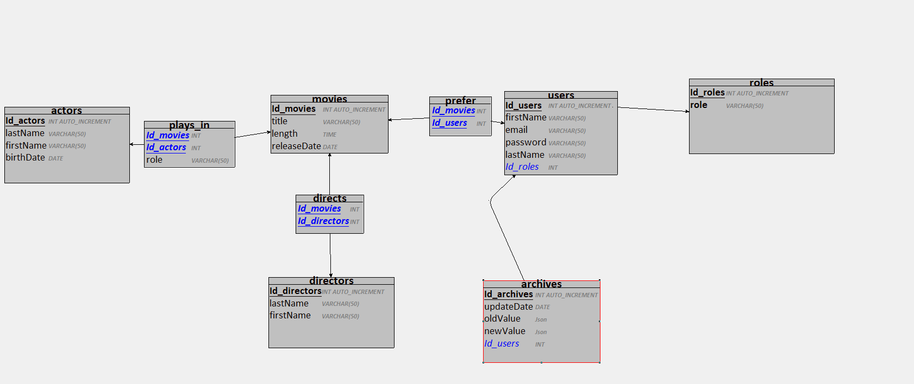
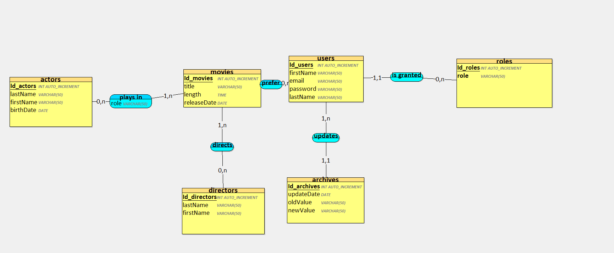
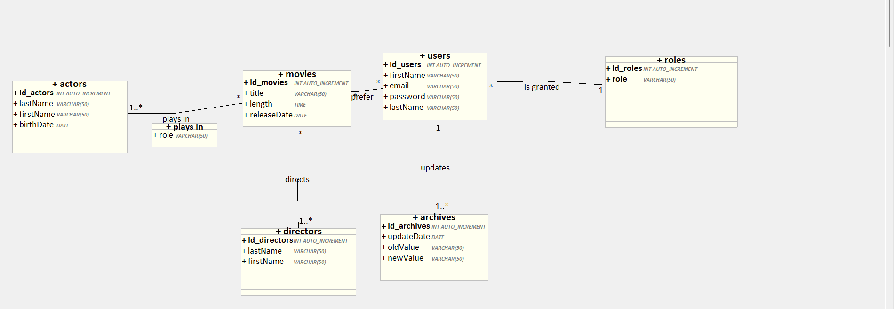

## streaming-ye

# Etape 1: Préparation de la Base de Données

Commencez par élaborer votre dictionnaire de données pour définir la structure de votre base de données.

créez ensuite le modèle conceptuel de données (MCD), suivi du modèle logique de données (MLD) et enfin du modèle physique de données (MPD).





# Étape 2 : Configuration de MySQL avec Docker

allez sur le terminal puis taper cette commande:

``` docker exec -it streaming-db mysql --password ```

``` CREATE DATABASE streaming; ```

```USE streaming;```


# Étape 3 : Création de la Base de Données

Créez votre base de données (BDD) en utilisant ce script sql.

``` SQL

CREATE TABLE movies(
   Id_movies INT AUTO_INCREMENT,
   title VARCHAR(50)  NOT NULL,
   length TIME NOT NULL,
   releaseDate DATE NOT NULL,
   PRIMARY KEY(Id_movies)
);

CREATE TABLE directors(
   Id_directors INT AUTO_INCREMENT,
   lastName VARCHAR(50)  NOT NULL,
   firstName VARCHAR(50)  NOT NULL,
   PRIMARY KEY(Id_directors)
);

CREATE TABLE actors(
   Id_actors INT AUTO_INCREMENT,
   lastName VARCHAR(50)  NOT NULL,
   firstName VARCHAR(50)  NOT NULL,
   birthDate DATE NOT NULL,
   PRIMARY KEY(Id_actors)
);

CREATE TABLE roles(
   Id_roles INT AUTO_INCREMENT,
   role VARCHAR(50)  NOT NULL,
   PRIMARY KEY(Id_roles),
   UNIQUE(role)
);

CREATE TABLE users(
   Id_users INT AUTO_INCREMENT,
   firstName VARCHAR(50)  NOT NULL,
   email VARCHAR(50)  NOT NULL,
   password VARCHAR(50)  NOT NULL,
   lastName VARCHAR(50)  NOT NULL,
   Id_roles INT NOT NULL,
   PRIMARY KEY(Id_users),
   FOREIGN KEY(Id_roles) REFERENCES roles(Id_roles)
);

CREATE TABLE archives(
   Id_archives INT AUTO_INCREMENT,
   updateDate DATE NOT NULL,
   oldValue VARCHAR(50)  NOT NULL,
   newValue VARCHAR(50)  NOT NULL,
   Id_users INT NOT NULL,
   PRIMARY KEY(Id_archives),
   FOREIGN KEY(Id_users) REFERENCES users(Id_users)
);

CREATE TABLE plays_in(
   Id_movies INT,
   Id_actors INT,
   role VARCHAR(50)  NOT NULL,
   PRIMARY KEY(Id_movies, Id_actors),
   FOREIGN KEY(Id_movies) REFERENCES movies(Id_movies),
   FOREIGN KEY(Id_actors) REFERENCES actors(Id_actors)
);

CREATE TABLE directs(
   Id_movies INT,
   Id_directors INT,
   PRIMARY KEY(Id_movies, Id_directors),
   FOREIGN KEY(Id_movies) REFERENCES movies(Id_movies),
   FOREIGN KEY(Id_directors) REFERENCES directors(Id_directors)
);

CREATE TABLE prefer(
   Id_movies INT,
   Id_users INT,
   PRIMARY KEY(Id_movies, Id_users),
   FOREIGN KEY(Id_movies) REFERENCES movies(Id_movies),
   FOREIGN KEY(Id_users) REFERENCES users(Id_users)
);
 ```


# Étape 4 : Remplissage de la Base de Données

Utilisez un jeu de données fictif (mock) pour remplir la base de données avec des données d'exemple.
```SQL


insert into actors (id_actors, lastName, firstName, birthDate) values (1, 'Nola', 'Allsop', '2022-01-05');
insert into actors (id_actors, lastName, firstName, birthDate) values (2, 'Maris', 'Durden', '1975-09-09');
insert into actors (id_actors, lastName, firstName, birthDate) values (3, 'Murielle', 'Corradino', '1990-04-17');
insert into actors (id_actors, lastName, firstName, birthDate) values (4, 'Marcelia', 'Le Batteur', '2013-10-07');
insert into actors (id_actors, lastName, firstName, birthDate) values (5, 'Mathian', 'Pentland', '1994-01-27');
insert into actors (id_actors, lastName, firstName, birthDate) values (6, 'Brenna', 'Smallshaw', '2016-12-26');
insert into actors (id_actors, lastName, firstName, birthDate) values (7, 'Newton', 'McGray', '1984-06-26');
insert into actors (id_actors, lastName, firstName, birthDate) values (8, 'Murvyn', 'Gillbee', '1986-05-28');
insert into actors (id_actors, lastName, firstName, birthDate) values (9, 'Berke', 'Sobieski', '2011-08-01');
insert into actors (id_actors, lastName, firstName, birthDate) values (10, 'Christoforo', 'Ramsted', '2008-07-28');
insert into movies (id_movies, title, length, releaseDate) values (1, 'Boy, Did I Get a Wrong Number!', 1, '2001-03-19');
insert into movies (id_movies, title, length, releaseDate) values (2, 'You', 2, '2022-10-27');
insert into movies (id_movies, title, length, releaseDate) values (3, 'Eversmile, New Jersey', 3, '2023-09-19');
insert into movies (id_movies, title, length, releaseDate) values (4, 'Friends of Eddie Coyle, The', 4, '2015-11-19');
insert into movies (id_movies, title, length, releaseDate) values (5, 'Fire with Fire', 5, '1998-10-29');
insert into movies (id_movies, title, length, releaseDate) values (6, 'Bells of St. Mary''s, The', 6, '2022-03-31');
insert into movies (id_movies, title, length, releaseDate) values (7, 'You Kill Me', 7, '1993-03-20');
insert into movies (id_movies, title, length, releaseDate) values (8, 'Hatchet II', 8, '2019-03-17');
insert into movies (id_movies, title, length, releaseDate) values (9, 'All at Sea', 9, '1994-11-26');
insert into movies (id_movies, title, length, releaseDate) values (10, 'Boy Interrupted', 10, '2013-02-22');
insert into directors (id_directors, lastName, firstName) values (1, 'Benedicto', 'Redsull');
insert into directors (id_directors, lastName, firstName) values (2, 'Tann', 'Woolbrook');
insert into directors (id_directors, lastName, firstName) values (3, 'Minerva', 'Downes');
insert into directors (id_directors, lastName, firstName) values (4, 'Willyt', 'Durant');
insert into directors (id_directors, lastName, firstName) values (5, 'Chiquita', 'Ever');
insert into directors (id_directors, lastName, firstName) values (6, 'Beryl', 'Ivan');
insert into directors (id_directors, lastName, firstName) values (7, 'Tabatha', 'Jozefczak');
insert into directors (id_directors, lastName, firstName) values (8, 'Ingamar', 'Brailsford');
insert into directors (id_directors, lastName, firstName) values (9, 'Richardo', 'Gottschalk');
insert into directors (id_directors, lastName, firstName) values (10, 'Kanya', 'Massingberd');——————————————————————————Roles
insert into roles (id_roles, role) values (1, ‘admin’);
insert into roles (id_roles, role) values (2, ‘user’);
insert into users (id_users, firstName, email, password, lastName, id_roles) values (1, 'Dorry', 'dkanzler0@spiegel.de', 'yY4fYVqcxfNF', 'Kanzler', 1);
insert into users (id_users, firstName, email, password, lastName, id_roles) values (2, 'Rebekah', 'rlowdes1@vk.com', 'sZ0_~XkgNbjfBM', 'Lowdes', 1);
insert into users (id_users, firstName, email, password, lastName, id_roles) values (3, 'Cleveland', 'cbromehed2@epa.gov', 'sS3@E9KU1c5C1>x', 'Bromehed', 31);
insert into users (id_users, firstName, email, password, lastName, id_roles) values (4, 'Korrie', 'kgilliver3@scientificamerican.com', 'bQ6?UL?u!1C6Z/K', 'Gilliver', 1);
insert into users (id_users, firstName, email, password, lastName, id_roles) values (5, 'Janos', 'jwrenn4@webnode.com', 'nQ2_E!i=S>,`n', 'Wrenn', 1);
insert into users (id_users, firstName, email, password, lastName, id_roles) values (6, 'Somerset', 'sdaubney5@ca.gov', 'qQ9H%4#*PP', 'D''Aubney', 2);
insert into users (id_users, firstName, email, password, lastName, id_roles) values (7, 'Angeli', 'aughetti6@1688.com', 'lB5Yo$g<a&*', 'Ughetti', 1);
insert into users (id_users, firstName, email, password, lastName, id_roles) values (8, 'Alleyn', 'aleishman7@printfriendly.com', 'vU45!Pn{', 'Leishman', 1);
insert into users (id_users, firstName, email, password, lastName, id_roles) values (9, 'Tammi', 'tfonzo8@imgur.com', 'cG2t>tq0', 'Fonzo', 2);
insert into users (id_users, firstName, email, password, lastName, id_roles) values (10, 'Mallorie', 'mcolman9@house.gov', 'zO8).Owm', 'Colman', 1);
insert into directs (id_movies, id_directors) values (1, 1);
insert into directs (id_movies, id_directors) values (2, 2);
insert into directs (id_movies, id_directors) values (3, 3);
insert into directs (id_movies, id_directors) values (4, 4);
insert into directs (id_movies, id_directors) values (5, 5);
insert into directs (id_movies, id_directors) values (6, 6);
insert into directs (id_movies, id_directors) values (7, 7);
insert into directs (id_movies, id_directors) values (8, 8);
insert into directs (id_movies, id_directors) values (9, 9);
insert into directs (id_movies, id_directors) values (10, 10);
insert into plays_in (id_movies, id_actors, role) values (1, 1, 'main_actor');
insert into plays_in (id_movies, id_actors, role) values (2, 2, 'main_actor');
insert into plays_in (id_movies, id_actors, role) values (3, 3, 'secondary_actor');
insert into plays_in (id_movies, id_actors, role) values (4, 4, 'main_actor');
insert into plays_in (id_movies, id_actors, role) values (5, 5, 'secondary_actor');
insert into plays_in (id_movies, id_actors, role) values (6, 6, 'main_actor');
insert into plays_in (id_movies, id_actors, role) values (7, 7, 'secondary_actor');
insert into plays_in (id_movies, id_actors, role) values (8, 8, 'main_actor');
insert into plays_in (id_movies, id_actors, role) values (9, 9, 'secondary_actor');
insert into plays_in (id_movies, id_actors, role) values (10, 10, 'main_actor');

```

# Étape 5 : Écriture et Test des Requêtes

Rédigez des requêtes SQL pour interagir avec la base de données, effectuer des opérations de lecture, d'écriture, de mise à jour, etc.
Testez ces requêtes pour vous assurer qu'elles fonctionnent correctement avec votre base de données.

# Les requête sql nécessaire

## les titres et dates de sortie des films du plus récent au plus ancien: 

``` SQL
SELECT title, releaseDate FROM movies ORDER BY releaseDate DESC;
```

## les noms, prénoms et âges des acteurs/actrices de plus de 30 ans dans l'ordre alphabétique:

``` SQL
SELECT lastName, firstName, TIMESTAMPDIFF(YEAR, birthDate, CURDATE()) AS age FROM actors WHERE TIMESTAMPDIFF(YEAR, birthDate, CURDATE()) > 30 ORDER BY lastName, firstName;
```


## la liste des acteurs/actrices principaux pour un film donné :

```SQL
SELECT actors.lastName, actors.firstName FROM actors INNER JOIN plays_in ON actors.Id_actors = plays_in.Id_actors INNER JOIN movies ON plays_in.Id_movies = movies.Id_movies WHERE movies.title = 'Viking’' AND plays_in.role = 'main_actor';
```

## la liste des films pour un acteur/actrice donné:

``` SQL
SELECT movies.title
FROM movies
INNER JOIN plays_in ON movies.Id_movies = plays_in.Id_movies
INNER JOIN actors ON plays_in.Id_actors = actors.Id_actors
WHERE actors.lastName = 'Brenna';
```

## ajouter un film:

``` SQL
INSERT INTO movies (title, length, releaseDate)
VALUES ('Nouveau film', '02:30:00', '2023-10-05');
```

## ajouter un acteur/actrice:
```SQL
INSERT INTO actors (lastName, firstName, birthDate)
VALUES ('Nouvel', 'Acteur', '1990-01-01');
```

## modifier un film:
``` SQL
UPDATE movies
SET title = 'Nouveau titre', releaseDate = '2023-12-31'
WHERE title = 'Nom du film';
```

## supprimer un acteur/actrice:
``` SQL
DELETE FROM actors
WHERE lastName = 'Nom de l'acteur';
```

## afficher les 3 derniers acteurs/actrices ajouté(e)s:
``` SQL
SELECT lastName, firstName, birthDate
FROM actors
ORDER BY Id_actors DESC
LIMIT 3;
```


##  Procedure
``` SQL
DELIMITER //
CREATE PROCEDURE ListMoviesByDirector(IN directorName VARCHAR(50))
BEGIN
  SELECT movies.title, movies.releaseDate
  FROM movies
  INNER JOIN directs ON movies.Id_movies = directs.Id_movies
  INNER JOIN directors ON directs.Id_directors = directors.Id_directors
  WHERE directors.lastName = directorName;
END;'
//
DELIMITER ;
```

CALL ListMoviesByDirector('Nom du réalisateur');
```SQL

DELIMITER //
CREATE TRIGGER UserUpdateTrigger
AFTER UPDATE ON users
FOR EACH ROW
BEGIN
  INSERT INTO archives (updateDate, id_users, oldvalue, newvalue)
  VALUES (NOW(), NEW.Id_users, JSON_OBJECT('firstName', OLD.firstName, 'lastName', OLD.lastName, 'email', OLD.email), JSON_OBJECT('firstName', NEW.firstName, 'lastName', NEW.lastName, 'email', NEW.email));
END;
//
DELIMITER ;
```
pour dbeaver mysql